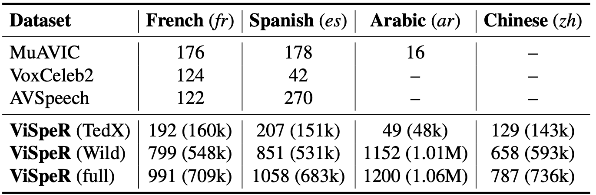

This repository contains **ViSpeR**, a large-scale dataset for Visual Speech Recognition for Arabic, Chinese, French and Spanish.

## Dataset Summary:

Given the scarcity of publicly available VSR data for non-English languages, we collected VSR data for the most four spoken languages at scale.


Comparison of VSR datasets. Our proposed ViSpeR dataset is larger in size compared to other datasets that cover non-English languages for the VSR task. For our dataset, the numbers in parenthesis denote the number of clips. We also give the clip coverage under TedX and Wild subsets of our ViSpeR dataset.



## Downloading the data:

First, use the langauge.json to download the videos and put them in seperate folders. The raw data should be structured as follows:
```bash
Data/
├── Chinese/
│ ├── video_id.mp4
│ └── ...
├── Arabic/
│ ├── video_id.mp4
│ └── ...
├── French/
│ ├── video_id.mp4
│ └── ...
├── Spanish/
│ ├── video_id.mp4
│ └── ...

```

## Setup:

1- Setup the environement:
 ```bash
conda create --name visper python=3.10
conda activate visper
pip install -r requirements.txt
```

2- Install ffmpeg:
 ```bash
conda install "ffmpeg<5" -c conda-forge
```

## Processing the data:

Then, use the provided metadata to process the raw data for creating the ViSpeR dataset. You can use the ```crop_videos.py``` to process the data, note that all clips are cropped and transformed

python crop_videos.py --video_dir [path_to_data_language] --save_path [save_path_language] --json [language_metadata.json] --use_ffmpeg True
```

```bash
ViSpeR/
├── Chinese/
│ ├── video_id/
│ │  │── 00001.mp4
│ │  │── 00001.json
│ └── ...
├── Arabic/
│ ├── video_id/
│ │  │── 00001.mp4
│ │  │── 00001.json
│ └── ...
├── French/
│ ├── video_id/
│ │  │── 00001.mp4
│ │  │── 00001.json
│ └── ...
├── Spanish/
│ ├── video_id/
│ │  │── 00001.mp4
│ │  │── 00001.json
│ └── ...

```

The ```video_id/xxxx.json``` has the 'label' of the corresponding video ```video_id/xxxx.mp4```.


## Intended Use

This dataset can be used to train models for visual speech recognition. It's particularly useful for research and development purposes in the field of audio-visual content processing. The data can be used to assess the performance of current and future models.

## Limitations and Biases
Due to the data collection process focusing on YouTube, biases inherent to the platform may be present in the dataset. Also, while measures are taken to ensure diversity in content, the dataset might still be skewed towards certain types of content due to the filtering process.


## Citation
```bash
@article{djilali2023vsr,
  title={Do VSR Models Generalize Beyond LRS3?},
  author={Djilali, Yasser Abdelaziz Dahou and Narayan, Sanath and Bihan, Eustache Le and Boussaid, Haithem and Almazrouei, Ebtessam and Debbah, Merouane},
  journal={arXiv preprint arXiv:2311.14063},
  year={2023}
}
```
